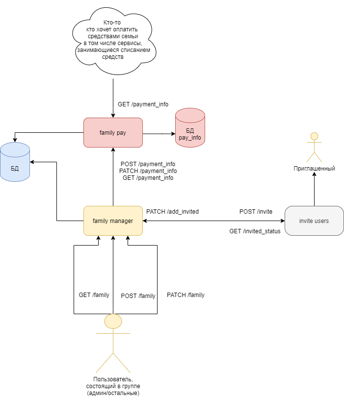

# Семейный аккаунт

## Описание фичи 
Объединение людей в группу, по 1-5 (N) человек. Первый человек создает группу, и считается главным, приглашает других через почту. 
В одно время человек может состоять только в одной группе. 
К группе присоединяется банковская карточка, с которой будет проводится плановая оплата и др. покупки группы.

Подобную фичу можно организовать для компании, которая каким-либо образом заказывает у Яндекса какие-либо сервисы, допустим ПО. 
После включения нового сотрудника в группу, он может пользоваться приобретенными фирмой благами 
или, допустим, в командировке выбирать способ оплаты - счет фирмы.

## Гипотезы

 - Если предусмотреть скидку соразмерную количеству человек в группе, можно привлекать большее число покупателей.
 - Меньшая нагрузка при снятии плановых оплат.
 - Удобство конечных пользователей.

## MVP

Для простой реализации необходимо добавить кнопку "создать семью", нажимая на которую создается группа. В меню группы 4 пункта: добавить/удалить члена семьи, распустить семью, добавить способ оплаты. 
Для членов семьи добавить способ оплаты "семейный". В меню группы есть пункт покинуть семью.

Завести базу данных, где хранится группа, а именно  id  семьи, членов семьи, создателя семьи и карточка для оплаты.

Для дальнейшего развития можно составить статистики по тратам с семейного счета, отчет по каждому участнику группы, лимиты по оплатам в месяц, накопительные плюшки для семьи.

## Архитектура

Нужен сервис по выдаче временных инвайт-ссылок и отправки их на почту приглашенному. 
Если он есть и легко расширяемый, то прикрутить к нему, иначе написать свой миниатюрный с бд и тд.
Invite users сервер должен уметь принимать заказы, давать статус по ним (истек/ не истек), при прохождении по инвайт-ссылке и заполнении формы (подтягивании данных из Яндекс Паспорта) посылать полученные данные на сервис family manager.

**Будем считать, что он есть и нормальный, то есть проверяет что пришел нужный человек в отведенное время**

Сервис family pay занимается выдачей информации для проведения оплат и тд (выведен отдельно тк у него повышенные требования к безопасности и отказоустойчивости). 
Так же занимается добавлением (возможно в зашифрованном виде) и проверкой на валидность предоставленной платежной информации.

Сервис family manager занимается делами семейными: создание/обновление/выдача информации/удалении семьи, а так же правами на изменение.

## Тесты
 * Unit:

    * family manager :
       * обновление/удаление/запрос данных несуществующей семьи;
       * при удалении семьи удалить платежную информацию;
       * при любом обновлении информации проверять что прислал обновления глава семьи;
       * проверять состоит ли добавляемый пользователь в других семьях (стандартно запрещено *меть много семей);
       * создатель не состоит в др семьях.

    * family pay:
        * при добавлении способа оплаты проверить существования семьи (проверка на права должна проходить еще в family manager);
        * при выдачи информации проверять, что запрашиваемый состоит в семье;
        * добавление/обновление невалидной платежной информации;
        * если способ еще не добавлен, ответ должен даваться понятным (семья есть, а способа еще нет);
        * проверка защищенности канала;
        * выдача информации только проверенным сервисам.

 * Интеграционные:
    * при встречном обращении family manager и invite users нет блокировки;
    * с family pay нормально взаимодействуют сервисы оплаты.

 * Нагрузочные:
    * отказоустойчивость и корректность работы при большом количестве запросов на family pay.

## Включение фичи

Постепенное сначала семьи сотрудников далее выбранные семьи и тд.