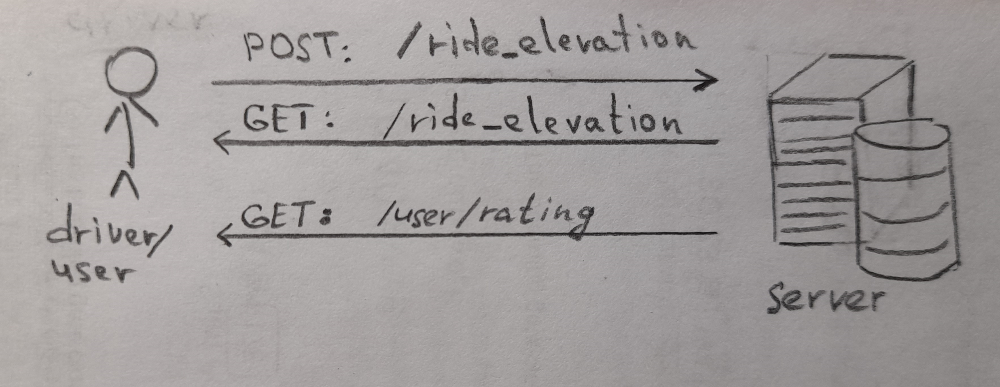

# Фича 1 - Рейтинг пассажира

### Описание задачи:

Нужно продумать логику выставления оценки водителем после завершения поездки, описать, где и в каком формате должен хранится рейтинг. Подумать над честной формулой вычисления общей оценки. Понять, какие нужны ендпоинты (ручки) для клиентского приложения и водительского. И другие особенности, все, что посчитаете важным.

### Зачем фича:
- Получать фидбек о поездке и от водителя
- Пассажиры будут более вежливыми, ведь знают, что их тоже будут оценивать

### Как будем рассчитывать рейтинг:

Рейтинг - средневзвешенное из последних 40 оценок. Вес будет варьироваться в диапазоне от 1 до 0,2 в зависимости от давности поездки.

### MVP

Нужно добавить формочку, которая бедет показываться после поездки. В формочке будет предлагаться оценить клиента (звёздочками от 1 до 5). Нужно предусмотреть ситуацию, когда у водителя нет желания ставить рейтинг.

### Архитектура

​

Понадобится всего две ручки:
- `POST:/ride_elevation` - чтобы выставить оценку клиенту за поездку
- `GET:/user/rating` - чтобы получить рейтинг клиента

Для хранения оценок клиента (оценки за поездку) предлагаю создать новую таблицу `ride_elevations` - оценки за поездки, с двумя столбцами ID поездки и оценка за поездку. При добавлении новой оценки клиента за поездку, должен происходить перерасчёт глобального рейтинга этого клиента. Глобальный рейтинг клиента предлагаю добавить в виде столбца в таблицу users (клиенты).

### Тесты

- Предлагаю покрыть юниттестами все ручки (обязательно рассмотреть граничный случай, когда нет ни одной оценки, следовательно нельзя рассчитать рейтинг)