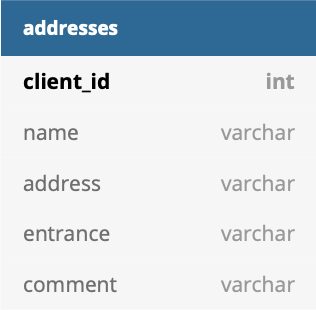

# Проработка фичи "Мои адреса"

## Описание
Очень простая, но удобная фича. Пользователь может добавлять "свои" адреса, например адрес дома, работы и другие, которые он часто использует в качесте точек начала/конца маршрута.
Далее при выборе адреса помимо адресов недавних поездок предлагаются сохраненные адреса по названию, которое дал пользователь.

## Гипотеза
Данная фича:
- ускоряет процесс заказа (не нужно вводить адрес целиком)
- снижает вероятность поставить не ту метку на карте (если адрес выбирается при помощи указателя на карте)
- снижает вероятность опечатки и выбора другого адреса (если адрес вводится текстом)

## MVP и полноценный вариант

Кажется, что из-за простоты фичи срезать углы просто негде. 
Конечно, для MVP можно реализовать фичу локально в приложении (сохранение всех адресов в кэше приложения, без запросов к серверу), ***но целесообразно ли?***

## Архитектура
Фичу будем реализовывать как отдельный микро-сервис - сlient-addresses.
У микросервиса будет своя БД, адреса будут храниться в табличке adresses вместе с вспомогательной информацией (название, подъезд, комментарий для водителя):

Для реализации фичи нам понадобится всего лишь одна ручка `/addresses` на которой будут реализованы CRUD-операции. Создание/редактирование/удаление адреса будет вызываться из клиентского приложения из специального экрана "Мои адреса".
При начале ввода адреса при заказе такси вызывается ручка на получение списка сохраненных адресов - далее они предлагаются пользователю по именам. 

Кажется, что схемы и диаграмы тут не нужны, т.к архитектура тривиальна.

## API
Более подробно с примерной схемой API можно ознакомиться в [openapi.yaml](assets/openapi.yaml)

## Тестирование 
Юнит-тестами покрываем:
- создание адреса
- редактирование адреса
- удаление адреса (+ повторное удаление по тому же id)
- невозможность изменить данные другого пользователя 

Кажется, что для такой маленькой фичи интеграционное и нагрузочное тестирование излишни.

## Раскатка фичи и метрики

- Делаем плавную раскатку: сначала на себе, потом на команде, далее на выборке клиентов (например, из одного города или на тех, кто часто ездит по одним и тем же маршрутам).
- Смотрим, насколько чаще клиенты выбирают сохраненный адрес дома/работы, чем набирают его вручную.
- Основная метрика - сократилось ли среднее время от открытия приложения до оформления заказа.
