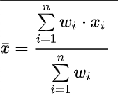
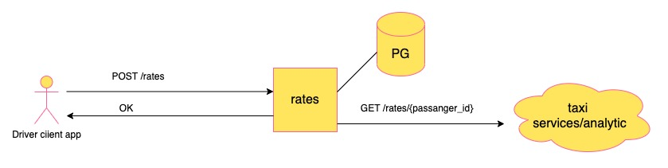
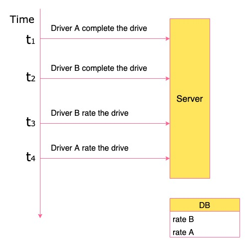
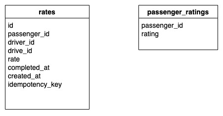
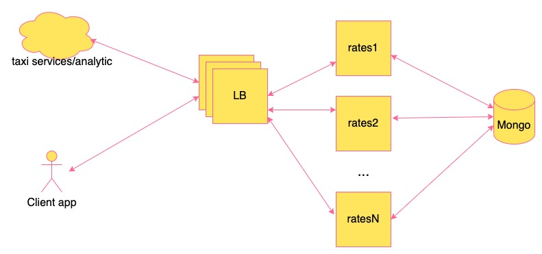

## Рейтинг пассажиров

Водитель оценивает пассажира. Пассажир имеет возможность увидеть свой текущий рейтинг.
Введя рейтинг для пассажиром мы, возможно, сможем улучшить качество такси для водителей. 
Пассажиры, стараясь улучшить свой рейтинг, будут более пунктуальнее, ставить более удобные точки и т.д.
Также это поможет нам анализировать какие критерии не нравятся водителем, для дальшейшего улучшения сервиса.

### Формула рейтинга

Возьмем средневзвешенное из последних 40 оценок. 
Недавние оценки имеют больше веса, чем старые.

Будем брать последние 40 оценок, сортировать их по свежести и нумеровать от 1 до 40.

`xi` - оценка водителя  
`wi` - вес (чем свежее оценка, тем выше вес)

### MVP

Сделаем MVP на Python и Postgres, развернутый на одной машине.

При получении нового рейтинга от водителя будем:
- брать последние 40 оценок (захардкодим этот параметр в коде)
- динамически генерировать веса (через оконную ф-ю `row_number`)
- пересчитывать рейтинг на стороне приложения и сохранять в базу

Т.к водитель может отправлять рейтинг после завершения поездки, может быть ситуация когда за старую поездку рейтинг ставится позже, чем за более свежую:    

Для разрешения этой ситуации будем сортировать по полю `completed_at` - время выполнения заказа, которое нам будет отправлять клиентское приложение.

Сделаем 2 ручки:
- добавление рейтинга водителем (идемпотентный)
- получение рейтинга пассажира  

[openapi](assets/openapi.yaml)
  
Схема базы:  

### Полноценный вариант
Для того, чтобы подготовить наш сервис к нагрузке, добавим балансировщики (Load Balancer, LB) и размажем нагрузку на несколько инстансов (контейнеров).  
Для выбора кол-ва инстансов проведем нагрузочное тестирование.

В качесве базы перейдем на MongoDB, т.к у нас:
- по результатам MVP получилась нереляционная структура
- проще масштабируется

Интерфейс взаимодействия с внешним миром остается таким же как и в MVP варианте.

### Бизнеc метрики
- Сколько водителей делают оценки?
- Корреляция принятия пассажира с хорошим/плохим рейтингом водителем
